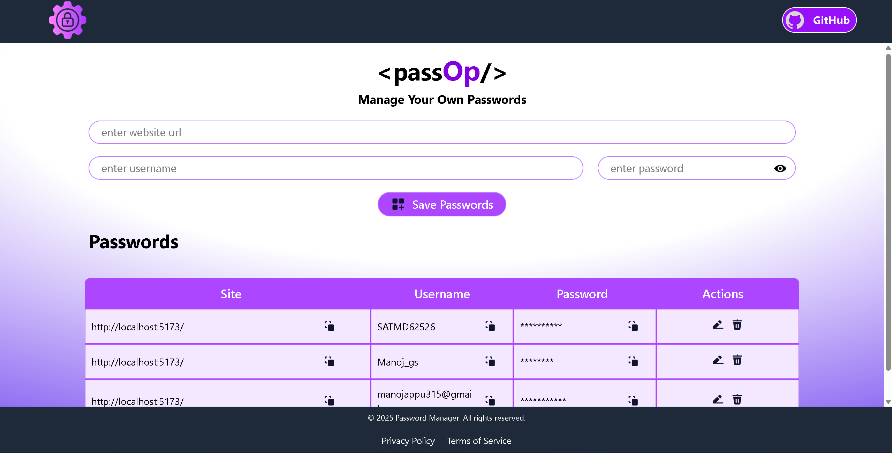
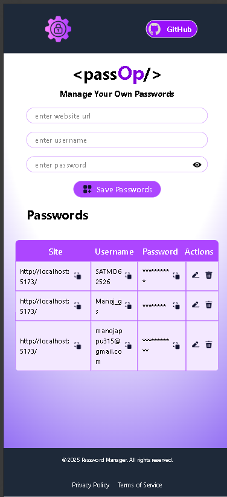

# 🔐 Password Manager

A full-stack password manager application to store, manage, and delete credentials using a Node.js + Express backend and MongoDB database.  
**Note:** This is a learning/demo project and does not include user authentication — it's not intended for production use.

---

## 📝 Features

- Add and update credentials using `POST` requests  
- Fetch all stored credentials via `GET`  
- Delete credentials with `DELETE`  
- Data stored securely in MongoDB  
- Built with a React + Vite frontend and Tailwind CSS for responsive UI  
- Express.js API handles backend operations with `cors` for cross-origin requests  

---

## 📸 Screenshots

### 💻 Desktop View  


### 📱 Mobile View  


---

## 🛠️ Tech Stack

### Frontend
- React  
- Vite  
- Tailwind CSS  

### Backend
- Node.js  
- Express.js  
- MongoDB  
- CORS  

---

## 🚀 Getting Started

### 🔧 Frontend Setup

1. Clone the repository and navigate to the frontend folder 

2. Install backend dependencies:

   ```bash
   npm install
   npm install tailwindcss @tailwindcss/forms

3. Start the backend server
   npm run dev   


### 🔧 Backend Setup

1. Clone the repository and navigate to the backend folder  

2. Install backend dependencies:

   ```bash
   npm install express
   npm install cors

3. Start the backend server
   node server.js
